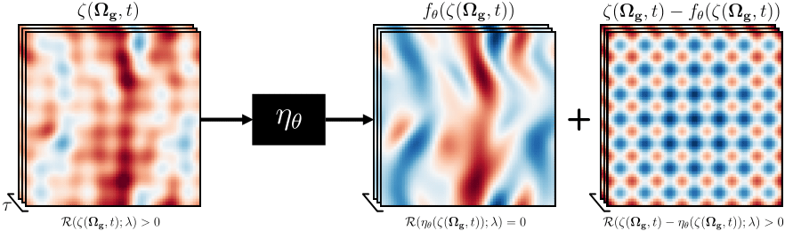

# PICR
[PICR :: Physics-Informed Convolutional Neural Networks for Corruption Removal on Dynamical System](https://arxiv.org/abs/2210.16215)
=======
**Authors:** Daniel Kelshaw, Luca Magri
<br>**Venue:** Accepted to NeurIPS 2022 Workshop on Machine Learning and the Physical Sciences

## Abstract
Measurements on dynamical systems, experimental or otherwise, are often subjected to inaccuracies capable of introducing corruption;
removal of which is a problem of fundamental importance in the physical sciences. In this work we propose physics-informed convolutional
neural networks for stationary corruption removal, providing the means to extract physical solutions from data, given access to partial
ground-truth observations at collocation points. We showcase the methodology for 2D incompressible Navier-Stokes equations in the
chaotic-turbulent flow regime, demonstrating robustness to modality and magnitude of corruption.

&nbsp;



&nbsp;

## Getting Started
All code to reproduce experiments can be found in the `./src` folder:

1. Generate data using `./src/data/generate_*.py`
2. Run Experiments using `./src/experiments/mp_*_experiment.py`
3. Run post-processing using `./src/postprocessing/produce_paper_results.ipynb`

Defaults have been set to the same as used in the paper.

**Note:** the post-processing relies on a particular file structure:

```text
<experiment_folder>/<MAG/FREQ>/<system_name>/<experiment_id>/<repeat>
```

The `./src/experiments/mp_*_experiment.py` handles the final two fields.


## Citation

```text
@inproceedings{Kelshaw2022,
  title = {Physics-Informed Convolutional Neural Networks for Corruption Removal on Dynamical Systems},
  author = {Daniel Kelshaw and Luca Magri},
  booktitle = {NeurIPS 2022 Workshop on Machine Learning and the Physical Sciences},
  year = {2022},
  url = {https://arxiv.org/abs/2210.16215}
}
```
